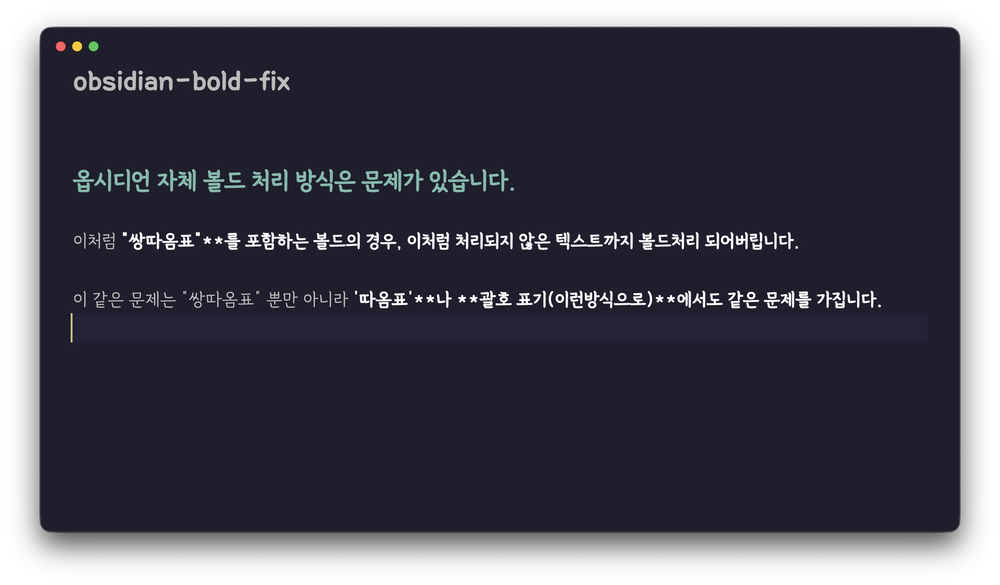
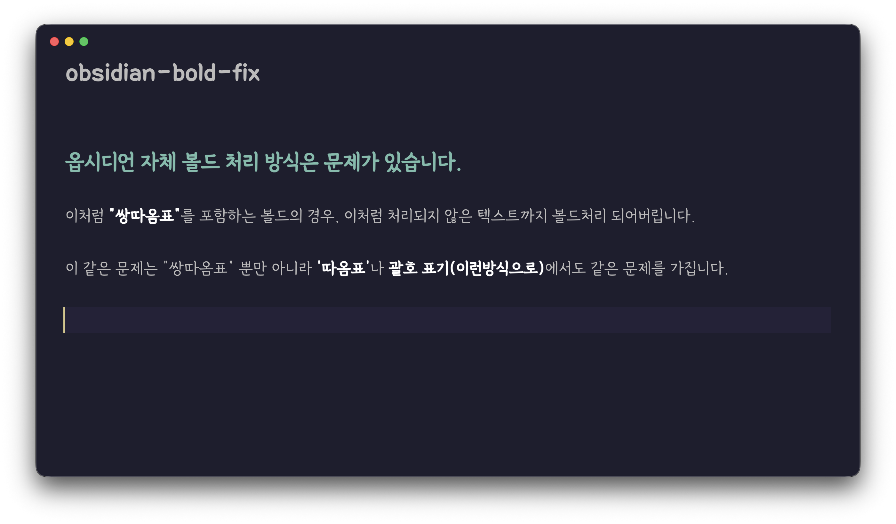

# Bold Fix - Obsidian Plugin

[한국어](README-kr.md)

Fix bold (`**bold**`) and italic (`*italic*`) rendering when followed by text without space.

## Problem

Obsidian's CodeMirror 6 parser follows CommonMark spec strictly. When `**bold**` or `*italic*` is immediately followed by text without space, the closing marker is not recognized, causing incorrect rendering.

```
**bold**text  →  "boldtext" all rendered as bold (incorrect)
```

This plugin fixes that behavior.

## Before & After

| Before | After |
|--------|-------|
|  |  |

## Features

- Fixes `**bold**` rendering in Live Preview and Reading View
- Fixes `*italic*` rendering in Live Preview and Reading View
- Preserves Obsidian's native behavior for showing `**`/`*` markers when cursor/selection overlaps

## Installation

```bash
# Create plugin folder
mkdir -p /path/to/vault/.obsidian/plugins/bold-fix

# Download files
curl -L -o /path/to/vault/.obsidian/plugins/bold-fix/main.js \
  https://raw.githubusercontent.com/wis-graph/obsidian-bold-fix/main/main.js

curl -L -o /path/to/vault/.obsidian/plugins/bold-fix/manifest.json \
  https://raw.githubusercontent.com/wis-graph/obsidian-bold-fix/main/manifest.json
```

Enable "Bold Fix" in Obsidian settings → Community plugins.

## Development

```bash
npm run dev    # Watch mode
npm run build  # Production build
```

## License

MIT
